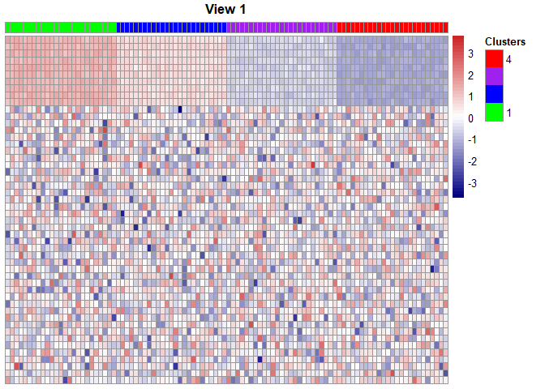
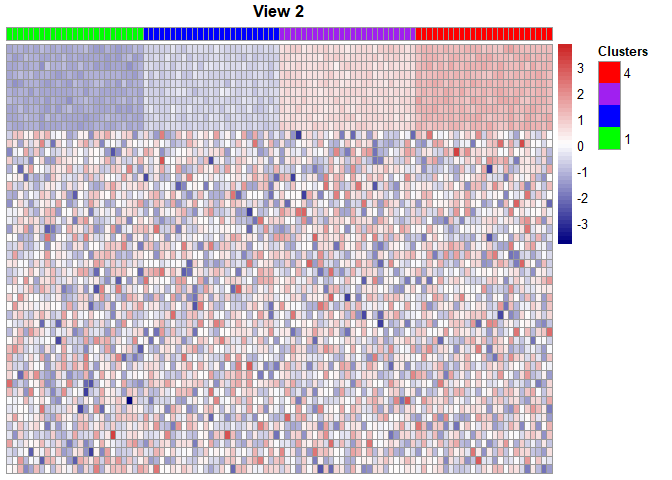
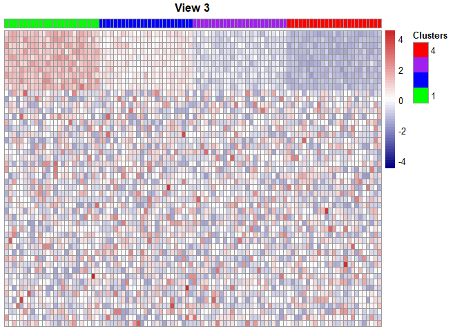
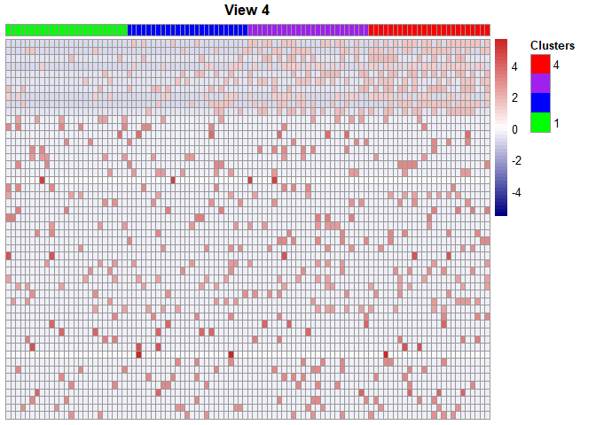
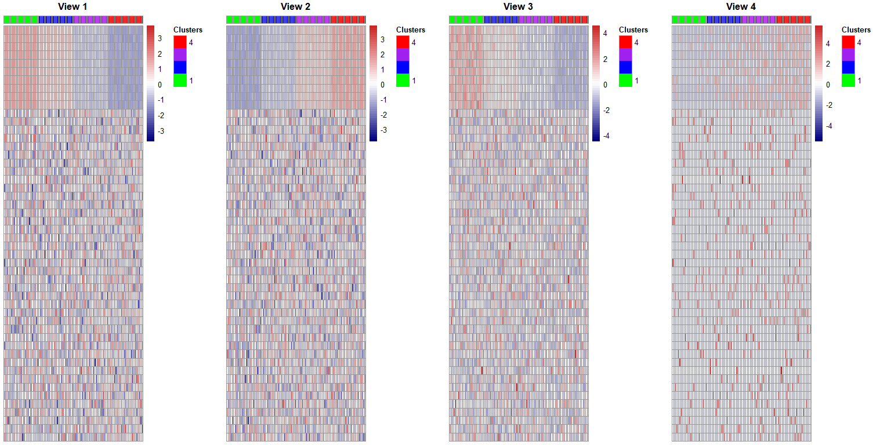
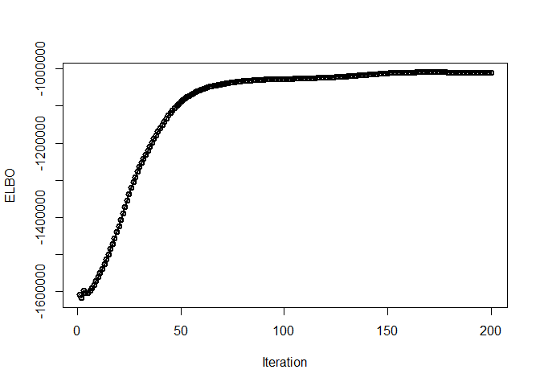
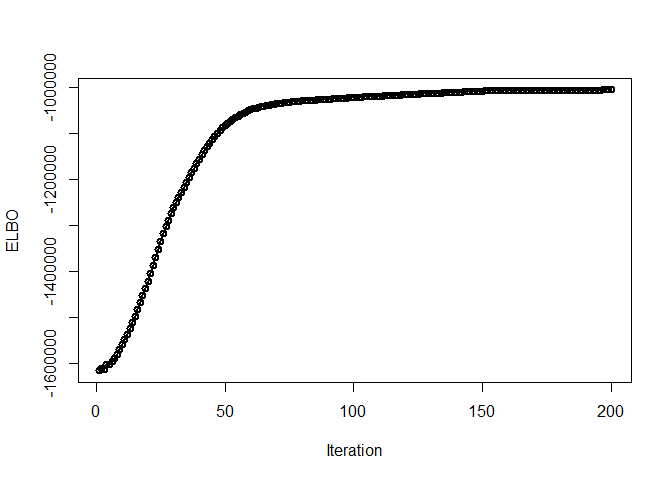
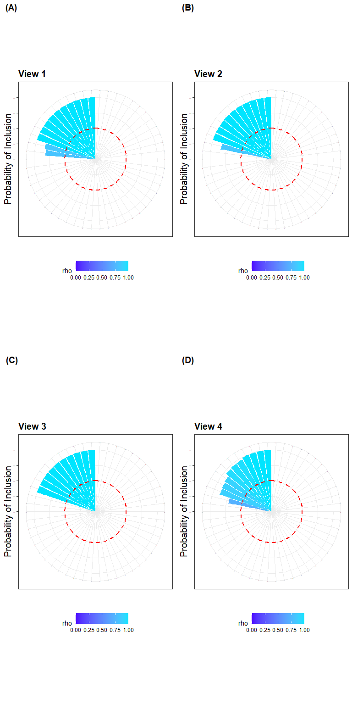

iClusterVB: A variational Bayes approach - User Manual
================

## Installing and loading the Package

``` r
devtools::install_github("AbdalkarimA/iClusterVB")
```

``` r
library(iClusterVB)
```

    ## Warning: replacing previous import 'Rcpp::registerPlugin' by
    ## 'inline::registerPlugin' when loading 'iClusterVB'

    ## Warning: replacing previous import 'mclust::dmvnorm' by 'mvtnorm::dmvnorm' when
    ## loading 'iClusterVB'

## Simulated Data

``` r
load("sim_data.Rdata")
```

### Viewing simulated data: Heatmap for features by clusters

``` r
library(pheatmap)
mat_colors <- list(Clusters = c("green","blue","purple", "red"))
mat_col <- data.frame(Clusters = as.numeric(simdata$cluster))

dat1 <- data.frame(t(simdata$continuous1_data));  
rownames(mat_col) <- colnames(dat1)
dat1 <- dat1[,order(as.numeric(simdata$cluster))]
gp_dat1 <- pheatmap(dat1,
    main = "View 1",
    cluster_rows = FALSE,
    cluster_cols = FALSE,
    color = colorRampPalette(c("navy", "white", "firebrick3"))(50), 
      treeheight_row=0,
    treeheight_col=0,
    scale = "row",
    show_colnames = FALSE,
    show_rownames = FALSE,
    annotation_names_row = FALSE,
    annotation_names_col = FALSE,
    annotation_col   = mat_col,
    annotation_colors= mat_colors)
```

<!-- -->

``` r
dat2 <- data.frame(t(simdata$continuous2_data));  
rownames(mat_col) <- colnames(dat2)
dat2 <- dat2[,order(as.numeric(simdata$cluster))]
gp_dat2 <- pheatmap(dat2,
    main = "View 2",
    cluster_rows = FALSE,
    cluster_cols = FALSE,
    color = colorRampPalette(c("navy", "white", "firebrick3"))(50), 
      treeheight_row=0,
    treeheight_col=0,
    scale = "row",
    show_colnames = FALSE,
    show_rownames = FALSE,
    annotation_names_row = FALSE,
    annotation_names_col = FALSE,
    annotation_col   = mat_col,
    annotation_colors= mat_colors)
```

<!-- -->

``` r
dat3 <- data.frame(t(simdata$count_data));  
rownames(mat_col) <- colnames(dat3)
dat3 <- dat3[,order(as.numeric(simdata$cluster))]
gp_dat3 <- pheatmap(dat3,
    main = "View 3",
    cluster_rows = FALSE,
    cluster_cols = FALSE,
    color = colorRampPalette(c("navy", "white", "firebrick3"))(50), 
      treeheight_row=0,
    treeheight_col=0,
    scale = "row",
    show_colnames = FALSE,
    show_rownames = FALSE,
    annotation_names_row = FALSE,
    annotation_names_col = FALSE,
    annotation_col   = mat_col,
    annotation_colors= mat_colors)
```

<!-- -->

``` r
dat4 <- data.frame(t(simdata$binary_data));  
rownames(mat_col) <- colnames(dat4)
dat4 <- dat4[,order(as.numeric(simdata$cluster))]
gp_dat4 <- pheatmap(dat4,
    main = "View 4",
    cluster_rows = FALSE,
    cluster_cols = FALSE,
    color = colorRampPalette(c("navy", "white", "firebrick3"))(50), 
      treeheight_row=0,
    treeheight_col=0,
    scale = "row",
    show_colnames = FALSE,
    show_rownames = FALSE,
    annotation_names_row = FALSE,
    annotation_names_col = FALSE,
    annotation_col   = mat_col,
    annotation_colors= mat_colors)
```

<!-- -->

``` r
library(ggplotify)
gp_dat1 <- as.ggplot(gp_dat1); 
gp_dat2 <- as.ggplot(gp_dat2); 
gp_dat3 <- as.ggplot(gp_dat3); 
gp_dat4 <- as.ggplot(gp_dat4); 
```

``` r
library(gridExtra)
grid.arrange(gp_dat1,gp_dat2,gp_dat3,gp_dat4, nrow = 1)
```

<!-- -->

## Using iClusterVB

### Pre-processing data

``` r
binary_data_new  <- simdata$binary_data
binary_data_new[binary_data_new==0] <- 2    # re-code the categorical variable
```

### Specifying data and the corresponding distributions to analyze

``` r
mydata <- list(simdata$continuous1_data,simdata$continuous2_data,simdata$count_data, binary_data_new )
dist <- c( "gaussian","gaussian","poisson", "multinomial" )

#Use "gaussian" for continuous data, "poisson"  for count data, and "multinomial" for binary data
```

### Fitting the model

``` r
K_max <- 8  # This is the maximum number of clusters
set.seed(41)
fit.iClusterVB <- iClusterVB(
         mydata = mydata,                                
         dist = dist,
         initial_method = "VarSelLCM",  # default initilization method
         VS_method = 1, 
         K = K_max,     
         max_iter = 200,
         per = 100) #to understand the arguments, please look at the iClusterVB.R file
```

    ## ------------------------------------------------------------ 
    ## Pre-pocessing and initilizing the model 
    ## ------------------------------------------------------------ 
    ## ------------------------------------------------------------ 
    ## Running the CAVI algorithm 
    ## ------------------------------------------------------------ 
    ## iteration = 100 elbo = -1027169.533127  
    ## iteration = 200 elbo = -1009510.694752

### Making a plot for ELBO (evidence lower bound) by iteration

``` r
iter <- fit.iClusterVB$iter
elbo <- fit.iClusterVB$elbo[1:iter]
plot(1:iter, elbo, 
    type = "o",
    lwd = 2, 
    xlab = "Iteration", 
    ylab = "ELBO")
```

<!-- -->

### Printing the cluster proportion

``` r
# ppi is a vector with a length of K_max
# note that the estimated ppi suggested that 
# only clusters 2, 3, 4 and 7 are non-empty, 
# each of these clusters yielded an estimated cluster proportion of 0.25. 
print(fit.iClusterVB$model_parameter$ppi)
```

    ##            [,1]    [,2]    [,3]    [,4]       [,5]       [,6]    [,7]
    ## [1,] 9.9992e-06 0.24999 0.24999 0.24999 9.9992e-06 9.9992e-06 0.24999
    ##            [,8]
    ## [1,] 9.9992e-06

### Printing the cluster membership

``` r
print(fit.iClusterVB$cluster)
```

    ##        [,1]
    ##   [1,]    2
    ##   [2,]    2
    ##   [3,]    2
    ##   [4,]    2
    ##   [5,]    2
    ##   [6,]    2
    ##   [7,]    2
    ##   [8,]    2
    ##   [9,]    2
    ##  [10,]    2
    ##  [11,]    2
    ##  [12,]    2
    ##  [13,]    2
    ##  [14,]    2
    ##  [15,]    2
    ##  [16,]    2
    ##  [17,]    2
    ##  [18,]    2
    ##  [19,]    2
    ##  [20,]    2
    ##  [21,]    2
    ##  [22,]    2
    ##  [23,]    2
    ##  [24,]    2
    ##  [25,]    2
    ##  [26,]    7
    ##  [27,]    7
    ##  [28,]    7
    ##  [29,]    7
    ##  [30,]    7
    ##  [31,]    7
    ##  [32,]    7
    ##  [33,]    7
    ##  [34,]    7
    ##  [35,]    7
    ##  [36,]    7
    ##  [37,]    7
    ##  [38,]    7
    ##  [39,]    7
    ##  [40,]    7
    ##  [41,]    7
    ##  [42,]    7
    ##  [43,]    7
    ##  [44,]    7
    ##  [45,]    7
    ##  [46,]    7
    ##  [47,]    7
    ##  [48,]    7
    ##  [49,]    7
    ##  [50,]    7
    ##  [51,]    3
    ##  [52,]    3
    ##  [53,]    3
    ##  [54,]    3
    ##  [55,]    3
    ##  [56,]    3
    ##  [57,]    3
    ##  [58,]    3
    ##  [59,]    3
    ##  [60,]    3
    ##  [61,]    3
    ##  [62,]    3
    ##  [63,]    3
    ##  [64,]    3
    ##  [65,]    3
    ##  [66,]    3
    ##  [67,]    3
    ##  [68,]    3
    ##  [69,]    3
    ##  [70,]    3
    ##  [71,]    3
    ##  [72,]    3
    ##  [73,]    3
    ##  [74,]    3
    ##  [75,]    3
    ##  [76,]    4
    ##  [77,]    4
    ##  [78,]    4
    ##  [79,]    4
    ##  [80,]    4
    ##  [81,]    4
    ##  [82,]    4
    ##  [83,]    4
    ##  [84,]    4
    ##  [85,]    4
    ##  [86,]    4
    ##  [87,]    4
    ##  [88,]    4
    ##  [89,]    4
    ##  [90,]    4
    ##  [91,]    4
    ##  [92,]    4
    ##  [93,]    4
    ##  [94,]    4
    ##  [95,]    4
    ##  [96,]    4
    ##  [97,]    4
    ##  [98,]    4
    ##  [99,]    4
    ## [100,]    4

``` r
table(fit.iClusterVB$cluster)
```

    ## 
    ##  2  3  4  7 
    ## 25 25 25 25

### Using a different (k-prototype) initializing method for cluster membership

``` r
set.seed(41)
fit.iClusterVB.kproto <- iClusterVB(
         mydata = mydata,                                
         dist = dist,
         initial_method = "kproto",
         VS_method = 1, 
         K = K_max,     
         max_iter = 200,
         per = 100)
```

    ## ------------------------------------------------------------ 
    ## Pre-pocessing and initilizing the model 
    ## ------------------------------------------------------------ 
    ## ------------------------------------------------------------ 
    ## Running the CAVI algorithm 
    ## ------------------------------------------------------------ 
    ## iteration = 100 elbo = -1022057.610353  
    ## iteration = 200 elbo = -1005419.696443

#### Making a plot for ELBO (evidence lower bound) by iteration

``` r
iter <- fit.iClusterVB.kproto$iter
elbo <- fit.iClusterVB.kproto$elbo[1:iter]
plot(1:iter, elbo, 
    type = "o",
    lwd = 2, 
    xlab = "Iteration", 
    ylab = "ELBO")
```

<!-- -->

#### Printing the cluster membership

``` r
table(fit.iClusterVB.kproto$cluster)
```

    ## 
    ##  2  3  4  5 
    ## 25 25 25 25

### Creating a barplot for the cluster proportion

``` r
library(ggplot2)
K <- length(table(fit.iClusterVB$cluster))      # number of clusters
N <- fit.iClusterVB$data_summary$N          # sample size
df <- data.frame(cbind(cluster=1:K,prop=round(as.numeric(table(fit.iClusterVB$cluster)/N),2)))
df$cluster <- factor(df$cluster,label=paste0("Cluster ",1:K))
gp_prop <- ggplot(df, aes(x = cluster, y = prop, 
                color=cluster, fill=cluster, 
                label = scales::percent(prop) )) +
  geom_bar( stat = "identity", position = "dodge")+
  theme_bw() +  
  ggtitle(" ") + 
  theme(legend.position = "none",legend.title=element_blank(),
      plot.title = element_text(size = 15, face = "bold",hjust = 0.5),
        axis.text=element_text(size=15),
        axis.title=element_text(size=15),
        legend.text=element_text(size=15),
        axis.text.x = element_text(angle = 0 ),
        strip.text.x = element_text(size = 15, angle = 0),
        strip.text.y = element_text(size = 15,face="bold"))+
        geom_text( position = position_dodge(.9), 
             vjust = -0.5, 
             size =5) +  
        xlab("")+ylab("Percentage (%)")   + 
    scale_y_continuous(labels = scales::percent,limit=c(0,1.05)) 
```

``` r
gp_prop
```

<!-- -->

### Extract the posterior probability of feature inclusion

``` r
fit.iClusterVB$model_parameters$rho[[1]]    # view 1
```

    ##      [,1] [,2] [,3] [,4] [,5] [,6] [,7] [,8] [,9] [,10]        [,11]
    ## [1,]    1    1    1    1    1    1    1    1    1     1 1.368836e-89
    ##             [,12]        [,13]        [,14]        [,15]        [,16]
    ## [1,] 5.061937e-90 5.230953e-91 1.412684e-72 9.217223e-89 6.835781e-90
    ##             [,17]        [,18]     [,19]        [,20]        [,21]        [,22]
    ## [1,] 2.217631e-90 3.044083e-91 0.8182102 5.764026e-86 1.148706e-89 2.791954e-91
    ##             [,23]        [,24]        [,25]        [,26]        [,27]
    ## [1,] 4.774769e-87 1.523523e-87 5.095173e-90 1.560737e-64 1.212368e-88
    ##             [,28]        [,29]        [,30]        [,31]        [,32]
    ## [1,] 2.008445e-90 1.380611e-89 2.116672e-88 7.947669e-89 6.463381e-88
    ##             [,33]        [,34]        [,35]        [,36]        [,37]
    ## [1,] 7.465043e-88 6.739981e-90 3.604163e-81 1.665049e-89 1.090585e-88
    ##             [,38]        [,39]     [,40]        [,41]      [,42]        [,43]
    ## [1,] 9.647545e-88 3.297689e-90 0.8457173 3.901947e-89 2.6317e-91 1.829967e-89
    ##             [,44]        [,45]        [,46]        [,47]        [,48]
    ## [1,] 2.428247e-92 2.555472e-87 7.315268e-91 1.927885e-90 1.418589e-89
    ##             [,49]        [,50]
    ## [1,] 8.899938e-89 1.534468e-88

``` r
fit.iClusterVB$model_parameters$rho[[2]]    # view 2
```

    ##      [,1] [,2] [,3] [,4] [,5] [,6] [,7] [,8] [,9] [,10]        [,11]
    ## [1,]    1    1    1    1    1    1    1    1    1     1 1.373385e-83
    ##            [,12]       [,13]       [,14]        [,15]        [,16]        [,17]
    ## [1,] 1.56848e-89 9.97978e-66 1.97652e-90 3.072331e-90 3.430105e-88 2.508539e-86
    ##             [,18]        [,19]        [,20]        [,21]        [,22]
    ## [1,] 6.876802e-90 3.484258e-91 4.549422e-85 4.413519e-91 2.633725e-88
    ##            [,23]        [,24]        [,25]        [,26]        [,27]
    ## [1,] 2.67674e-65 1.018573e-88 1.891781e-89 1.322016e-84 6.710684e-83
    ##             [,28]        [,29]        [,30]        [,31]        [,32]
    ## [1,] 5.459927e-87 4.721442e-90 1.159019e-90 6.671948e-91 4.890089e-91
    ##             [,33]        [,34]        [,35]        [,36]        [,37]
    ## [1,] 7.992343e-88 2.576203e-89 1.662099e-90 1.053501e-85 5.790748e-90
    ##            [,38]        [,39]     [,40]        [,41]        [,42]        [,43]
    ## [1,] 2.33317e-90 2.164586e-90 0.8388402 4.908487e-90 4.639942e-88 6.560327e-91
    ##             [,44]       [,45]        [,46]        [,47]        [,48]
    ## [1,] 1.499868e-88 2.73554e-90 3.677092e-91 1.133343e-90 3.415504e-82
    ##             [,49]       [,50]
    ## [1,] 5.300623e-90 2.71965e-89

``` r
fit.iClusterVB$model_parameters$rho[[3]]    # view 3
```

    ##      [,1] [,2] [,3] [,4] [,5] [,6] [,7] [,8] [,9] [,10]       [,11]
    ## [1,]    1    1    1    1    1    1    1    1    1     1 1.06038e-27
    ##             [,12]        [,13]        [,14]        [,15]        [,16]
    ## [1,] 2.692921e-25 5.377488e-24 1.360953e-20 4.339876e-27 5.547084e-29
    ##             [,17]        [,18]        [,19]        [,20]        [,21]
    ## [1,] 7.749953e-24 2.225556e-25 8.258225e-31 8.824631e-27 5.349607e-32
    ##             [,22]        [,23]        [,24]        [,25]        [,26]
    ## [1,] 1.206002e-30 3.558898e-26 3.130317e-29 8.572691e-36 2.236602e-29
    ##             [,27]       [,28]        [,29]        [,30]        [,31]
    ## [1,] 1.180802e-26 1.06335e-29 9.636901e-08 1.776438e-28 6.398802e-29
    ##             [,32]        [,33]        [,34]       [,35]        [,36]
    ## [1,] 1.796395e-25 2.837599e-26 7.859147e-12 2.37934e-09 4.381826e-24
    ##             [,37]        [,38]        [,39]        [,40]        [,41]
    ## [1,] 2.125757e-37 8.944039e-23 2.019251e-18 7.667619e-23 8.139177e-30
    ##             [,42]        [,43]        [,44]        [,45]        [,46]
    ## [1,] 4.914732e-25 3.706948e-33 9.144801e-34 2.689099e-26 1.345479e-28
    ##             [,47]       [,48]        [,49]       [,50]
    ## [1,] 5.784242e-33 6.52512e-32 1.239412e-32 1.69532e-33

``` r
fit.iClusterVB$model_parameters$rho[[4]]    # view 4
```

    ##           [,1]      [,2]      [,3]      [,4]      [,5]      [,6]      [,7]
    ## [1,] 0.9999998 0.9692257 0.9038587 0.9975713 0.9677465 0.9574329 0.8888361
    ##           [,8]      [,9]     [,10]        [,11]        [,12]        [,13]
    ## [1,] 0.8835934 0.9941844 0.9999901 1.429158e-19 8.878108e-20 1.755714e-21
    ##             [,14]        [,15]        [,16]        [,17]        [,18]
    ## [1,] 5.284333e-21 3.832329e-08 8.853857e-21 8.497575e-18 5.552565e-19
    ##             [,19]        [,20]        [,21]        [,22]        [,23]
    ## [1,] 2.433471e-22 3.091323e-21 8.769419e-18 2.806905e-21 4.888527e-20
    ##            [,24]       [,25]        [,26]     [,27]        [,28]        [,29]
    ## [1,] 2.09177e-21 5.28147e-19 8.356989e-21 0.7130894 9.881208e-21 1.069293e-21
    ##             [,30]        [,31]        [,32]      [,33]        [,34]
    ## [1,] 4.349156e-21 1.866598e-20 3.733148e-21 4.3021e-21 4.976334e-21
    ##             [,35]        [,36]        [,37]        [,38]        [,39]
    ## [1,] 3.622492e-20 1.025845e-20 6.125832e-21 1.364009e-21 2.661532e-21
    ##            [,40]        [,41]        [,42]        [,43]        [,44]
    ## [1,] 4.24027e-20 7.692645e-22 3.807924e-23 7.216293e-20 1.114599e-20
    ##             [,45]       [,46]        [,47]        [,48]        [,49]
    ## [1,] 3.185977e-21 2.31734e-21 1.629371e-21 1.196871e-20 4.681252e-21
    ##             [,50]
    ## [1,] 4.818046e-21

### Visualizing the clusters and selected features

``` r
dat1 <- data.frame(varid = 1:length(fit.iClusterVB$model_parameters$rho[[1]]), rho = t(fit.iClusterVB$model_parameters$rho[[1]]))
dat2 <- data.frame(varid = 1:length(fit.iClusterVB$model_parameters$rho[[2]]), rho = t(fit.iClusterVB$model_parameters$rho[[2]]))
dat3 <- data.frame(varid = 1:length(fit.iClusterVB$model_parameters$rho[[3]]), rho = t(fit.iClusterVB$model_parameters$rho[[3]]))
dat4 <- data.frame(varid = 1:length(fit.iClusterVB$model_parameters$rho[[4]]), rho = t(fit.iClusterVB$model_parameters$rho[[4]]))
```

``` r
library(ggplot2)
gp_rho1 <- ggplot(dat1, aes(x=reorder(varid, rho), y=rho, fill=rho )) + 
     geom_bar(stat="identity")+
     ggtitle("View 1")+
     ylim (c(0,1))+
     geom_hline( yintercept = 0.5, color = "red",  linewidth = 1, linetype = 2) + 
     theme_bw() + 
     theme(legend.position = "bottom",
            plot.title = element_text(size = 15, face = "bold"),
            axis.text=element_text(size=1),
            axis.title=element_text(size=15),
            axis.text.x = element_text(angle = 0, vjust = 0.5, hjust=1),
            strip.text.x = element_text(size = 1, angle = 0),
            strip.text.y = element_text(size = 15,face="bold")) + 
     xlab(" ") + ylab("Probability of Inclusion")   + 
    scale_fill_gradientn( colors = topo.colors(2), limits=c(0,1)) + 
     coord_polar()  
gp_rho2 <- ggplot(dat2, aes(x=reorder(varid, rho), y=rho, fill=rho )) + 
     geom_bar(stat="identity")+
     ggtitle("View 2")+
     ylim (c(0,1))+
     geom_hline( yintercept = 0.5, color = "red",  linewidth = 1, linetype = 2) + 
     theme_bw() + 
     theme(legend.position = "bottom",
            plot.title = element_text(size = 15, face = "bold"),
            axis.text=element_text(size=1),
            axis.title=element_text(size=15),
            axis.text.x = element_text(angle = 0, vjust = 0.5, hjust=1),
            strip.text.x = element_text(size = 1, angle = 0),
            strip.text.y = element_text(size = 15,face="bold")) + 
     xlab(" ") + ylab("Probability of Inclusion")   + 
    scale_fill_gradientn( colors = topo.colors(2), limits=c(0,1)) + 
     coord_polar()  
gp_rho3 <- ggplot(dat3, aes(x=reorder(varid, rho), y=rho, fill=rho )) + 
     geom_bar(stat="identity")+
     ggtitle("View 3")+
     ylim (c(0,1))+
     geom_hline( yintercept = 0.5, color = "red",  linewidth = 1, linetype = 2) + 
     theme_bw() + 
     theme(legend.position = "bottom",
            plot.title = element_text(size = 15, face = "bold"),
            axis.text=element_text(size=1),
            axis.title=element_text(size=15),
            axis.text.x = element_text(angle = 0, vjust = 0.5, hjust=1),
            strip.text.x = element_text(size = 1, angle = 0),
            strip.text.y = element_text(size = 15,face="bold")) + 
     xlab(" ") + ylab("Probability of Inclusion")  + 
    scale_fill_gradientn( colors = topo.colors(2), limits=c(0,1)) + 
     coord_polar()  
gp_rho4 <- ggplot(dat4, aes(x=reorder(varid, rho), y=rho, fill=rho )) + 
     geom_bar(stat="identity")+
     ggtitle("View 4")+
     ylim (c(0,1))+
     geom_hline( yintercept = 0.5, color = "red",  linewidth = 1, linetype = 2) + 
     theme_bw() + 
     theme(legend.position = "bottom",
            plot.title = element_text(size = 15, face = "bold"),
            axis.text=element_text(size=1),
            axis.title=element_text(size=15),
            axis.text.x = element_text(angle = 0, vjust = 0.5, hjust=1),
            strip.text.x = element_text(size = 1, angle = 0),
            strip.text.y = element_text(size = 15,face="bold")) + 
     xlab(" ") + ylab("Probability of Inclusion")  + 
    scale_fill_gradientn( colors = topo.colors(2), limits=c(0,1)) + 
     coord_polar() 
```

``` r
library(cowplot)
plot_grid(gp_rho1,
        gp_rho2,
        gp_rho3,
        gp_rho4,
        labels=c("(A)", "(B)", "(C)", "(D)"), nrow = 2, align = "hv" )
```

<!-- -->
