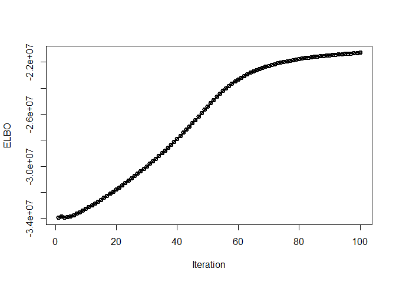
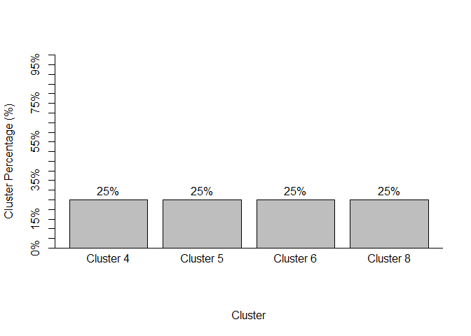
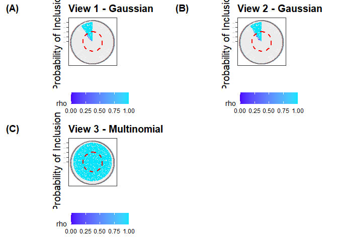
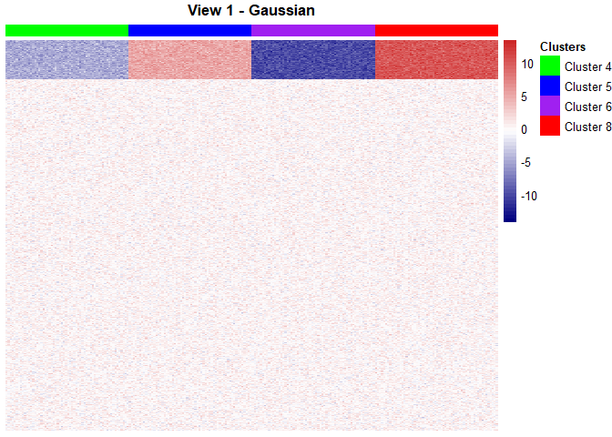
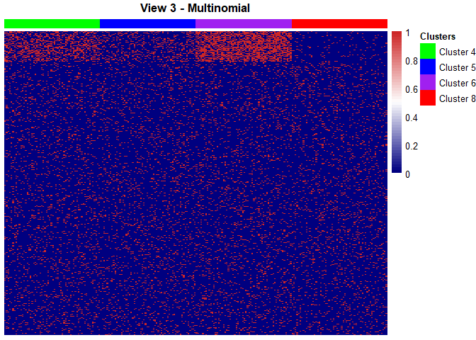
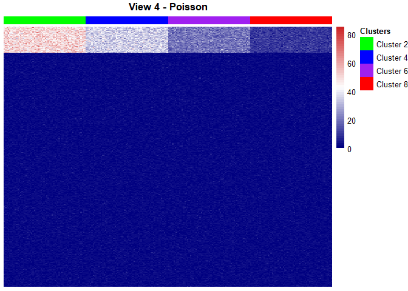

<!-- README.md is generated from README.Rmd. Please edit that file -->

# iClusterVB

<!-- badges: start -->

<!-- badges: end -->

iClusterVB allows for fast integrative clustering and feature selection
for high dimensional data.

Using a variational Bayes approach, its key features - clustering of
mixed-type data, automated determination of the number of clusters, and
feature selection in high-dimensional settings - address the limitations
of traditional clustering methods while offering an alternative and
potentially faster approach than MCMC algorithms, making **iClusterVB**
a valuable tool for contemporary data analysis challenges.

## Installation

You can install the development version of iClusterVB from
[GitHub](https://github.com/AbdalkarimA/iClusterVB) with:

``` r
# install.packages("devtools")
devtools::install_github("AbdalkarimA/iClusterVB")
```

## iClusterVB - The Main Function

***Mandatory arguments***

- `mydata`: A list of length R, where R is the number of datasets,
  containing the input data.

  - Note: For **categorical** data, `0`’s must be re-coded to another,
    non-`0` value.

- `dist`: A vector of length R specifying the type of data or
  distribution. Options include: "gaussian" (for continuous data),
  "multinomial" (for binary or categorical data), and "poisson" (for
  count data).

<div class="flushleft">

***Optional arguments***

</div>

- `K`: The maximum number of clusters, with a default value of 10. The
  algorithm will converge to a model with dominant clusters, removing
  redundant clusters and automating the process of determining the
  number of clusters.

- `initial_method`: The method for the initial cluster allocation, which
  the iClusterVB algorithm will then use to determine the final cluster
  allocation. Options include "VarSelLCM" (default) for VarSelLCM,
  "random" for a random sample, "kproto" for k-prototypes, "kmeans" for
  k-means (continuous data only), "mclust" for mclust (continuous data
  only), or "lca" for poLCA (categorical data only).

- `VS_method`: The feature selection method. The options are 0 (default)
  for clustering without feature selection and 1 for clustering with
  feature selection

- `initial_cluster`: The initial cluster membership. The default is
  NULL, which uses `initial_method` for initial cluster allocation. If
  it is not NULL, it will overwrite the previous initial values setting
  for this parameter.

- `initial_vs_prob`: The initial feature selection probability, a
  scalar. The default is NULL, which assigns a value of 0.5.

- `initial_fit`: Initial values based on a previously fitted iClusterVB
  model (an iClusterVB object). The default is NULL.

- `initial_omega`: Customized initial values for feature inclusion
  probabilities. The default is NULL. If the argument is not NULL, it
  will overwrite the previous initial values setting for this parameter.
  If `VS_method = 1`, `initial_omega` is a list of length R, and each
  element of the list is an array with dim=c(N,p$$\[r$$\])). N is the
  sample size and p$$\[r$$\] is the number of features for dataset r, r
  = 1,...,R.

- `initial_hyper_parameters`: A list of the initial hyper-parameters of
  the prior distributions for the model. The default is NULL, which
  assigns `alpha_00 = 0.001, mu_00 = 0,`  
  `s2_00 = 100, a_00 = 1, b_00 = 1, kappa_00 = 1, u_00 = 1, v_00 = 1`.
  These are
  $\pmb{\alpha}_0, \mu_0, s^2_0, a_0, b_0, \pmb{\kappa}_0, c_0, \text{and } d_0$
  described in the research article that was submitted. The citation
  will be updated to display the paper once it is ready.

- `max_iter`: The maximum number of iterations for the VB algorithm. The
  default is 200.

- `early_stop`: Whether to stop the algorithm upon convergence or to
  continue until `max_iter` is reached. Options are 1 (default) to stop
  when the algorithm converges, and 0 to stop only when `max_iter` is
  reached.

- `per`: Print information every "per" iteration. The default is 10.

- `convergence_threshold`: The convergence threshold for the change in
  ELBO. The default is 0.0001.

## Simulated Data

We will demonstrate the clustering and feature selection performance of
`iClusterVB` using a simulated dataset comprising $N = 240$ individuals
and $R = 4$ data views with different data types. Two views were
continuous, one was count, and one was binary – a setup commonly found
in genomics data where gene or mRNA expression (continuous), DNA copy
number (count), and mutation presence (binary) are observed. The true
number of clusters ($K$) was set to 4, with balanced cluster proportions
($\pi_1 = 0.25, \pi_2 = 0.25, \pi_3 = 0.25, \pi_4 = 0.25$). Each data
view consisted of $p_r = 500$ features ($r = 1, \dots, 4$), totaling
$p = \sum_{r=1}^4 p_r = 2000$ features across all views. Within each
view, only 50 features (10%) were relevant for clustering, while the
remaining features were noise. The relevant features were distributed
across clusters as described in the table below:

<div id="tab:simulated-dataset">

| **Data View**  | **Cluster** | **Distribution**                    |
|:---------------|:------------|:------------------------------------|
| 1 (Continuous) | Cluster 1   | $\mathcal{N}(10, 1)$ (Relevant)     |
|                | Cluster 2   | $\mathcal{N}(5, 1)$ (Relevant)      |
|                | Cluster 3   | $\mathcal{N}(-5, 1)$ (Relevant)     |
|                | Cluster 4   | $\mathcal{N}(-10, 1)$ (Relevant)    |
|                |             | $\mathcal{N}(0, 1)$ (Noise)         |
| 2 (Continuous) | Cluster 1   | $\mathcal{N}(-10, 1)$ (Relevant)    |
|                | Cluster 2   | $\mathcal{N}(-5, 1)$ (Relevant)     |
|                | Cluster 3   | $\mathcal{N}(5, 1)$ (Relevant)      |
|                | Cluster 4   | $\mathcal{N}(10, 1)$ (Relevant)     |
|                |             | $\mathcal{N}(0, 1)$ (Noise)         |
| 3 (Binary)     | Cluster 1   | $\text{Bernoulli}(0.05)$ (Relevant) |
|                | Cluster 2   | $\text{Bernoulli}(0.2)$ (Relevant)  |
|                | Cluster 3   | $\text{Bernoulli}(0.4)$ (Relevant)  |
|                | Cluster 4   | $\text{Bernoulli}(0.6)$ (Relevant)  |
|                |             | $\text{Bernoulli}(0.1)$ (Noise)     |
| 4 (Count)      | Cluster 1   | $\text{Poisson}(50)$ (Relevant)     |
|                | Cluster 2   | $\text{Poisson}(35)$ (Relevant)     |
|                | Cluster 3   | $\text{Poisson}(20)$ (Relevant)     |
|                | Cluster 4   | $\text{Poisson}(10)$ (Relevant)     |
|                |             | $\text{Poisson}(2)$ (Noise)         |

Distribution of relevant and noise features across clusters in each data
view

</div>

The simulated dataset is included as a list in the package.

### Data pre-processing

``` r
library(iClusterVB)

# Input data must be a list

dat1 <- list(gauss_1 = sim_data$continuous1_data,
             gauss_2 = sim_data$continuous2_data,
             multinomial_1 = sim_data$binary_data,
             poisson_1 = sim_data$count_data)

dist <- c("gaussian", "gaussian",
          "multinomial", "poisson")

# Re-code `0`s to `2`s. This must be done for feature selection 
# and clustering to work properly.
dat1$multinomial_1[dat1$multinomial_1 == 0] <- 2
```

### Running the model

``` r
set.seed(123)
fit_iClusterVB <- iClusterVB(
  mydata = dat1,
  dist = dist,
  K = 8,
  initial_method = "kproto",
  VS_method = 1, # Variable Selection is on
  max_iter = 100,
  per = 20
)
#> ------------------------------------------------------------
#> Pre-processing and initializing the model
#> ------------------------------------------------------------
#> 
#> ------------------------------------------------------------
#> Running the CAVI algorithm
#> ------------------------------------------------------------
#> iteration = 20 elbo = -70674227.531156  
#> iteration = 40 elbo = -63616639.978262  
#> iteration = 60 elbo = -55236748.725071  
#> iteration = 80 elbo = -49220663.903095  
#> iteration = 100 elbo = -44169515.356301
```

### Comparing to True Cluster Membership

``` r
table(fit_iClusterVB$cluster, sim_data$cluster_true)
#>    
#>      1  2  3  4
#>   5  0  0  0 60
#>   6  0  0 60  0
#>   7 60  0  0  0
#>   8  0 60  0  0
```

### Summary of the Model

``` r
# We can obtain a summary using summary()
summary(fit_iClusterVB)
#> Total number of individuals:
#> [1] 240
#> 
#> User-inputted maximum number of clusters: 8
#> Number of clusters determined by algorithm: 4
#> 
#> Cluster Membership:
#>  5  6  7  8 
#> 60 60 60 60 
#> 
#> # of variables above the posterior inclusion probability of 0.5 for View 1 - gaussian
#> [1] "56 out of a total of 500"
#> 
#> # of variables above the posterior inclusion probability of 0.5 for View 2 - gaussian
#> [1] "58 out of a total of 500"
#> 
#> # of variables above the posterior inclusion probability of 0.5 for View 3 - multinomial
#> [1] "64 out of a total of 500"
#> 
#> # of variables above the posterior inclusion probability of 0.5 for View 4 - poisson
#> [1] "67 out of a total of 500"
```

### Generic Plots

``` r
plot(fit_iClusterVB)
```



### Probability of Inclusion Plots

``` r
# The `piplot` function can be used to visualize the probability of inclusion

piplot(fit_iClusterVB)
```



### Heat maps to visualize the clusters

``` r
# The `chmap` function can be used to display heat maps for each data view

list_of_plots <- chmap(fit_iClusterVB, rho = 0,
      cols = c("green", "blue",
               "purple", "red"),
      scale = "none")
```



``` r
# The `grid.arrange` function from gridExtra can be used to display all the 
# plots together
gridExtra::grid.arrange(grobs = list_of_plots, ncol = 2, nrow = 2)
```


